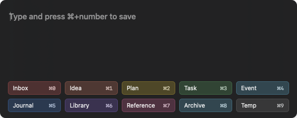
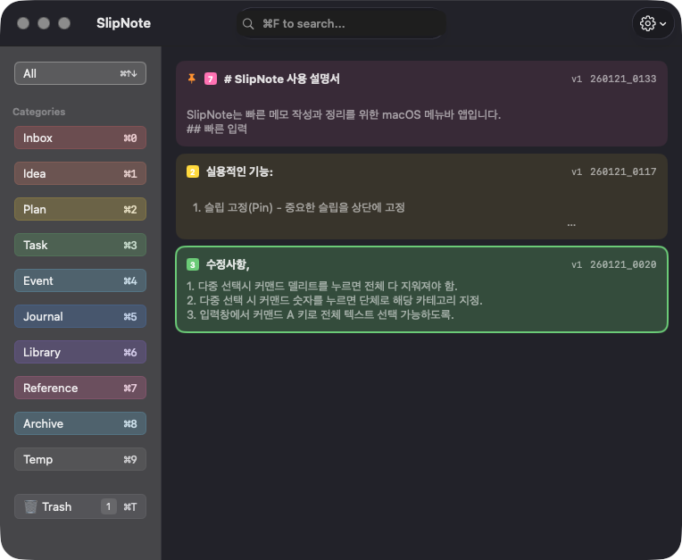
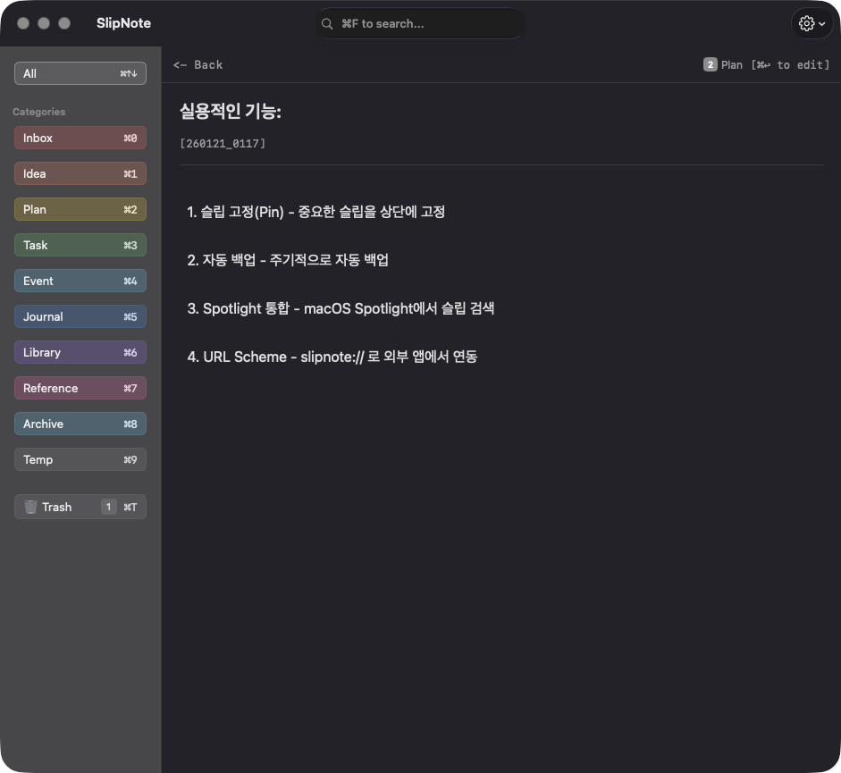
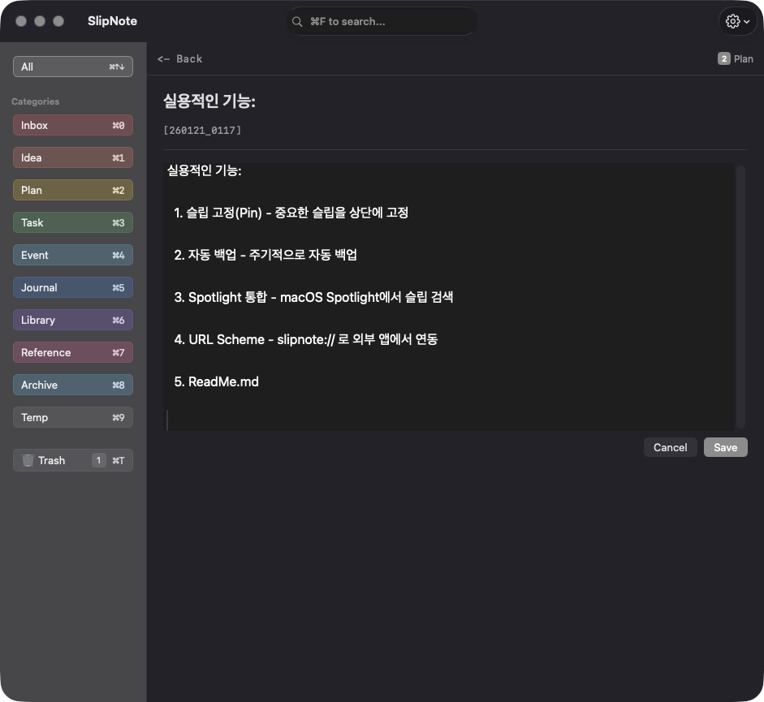
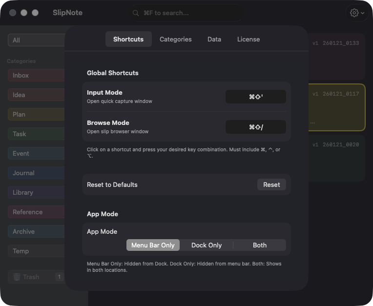
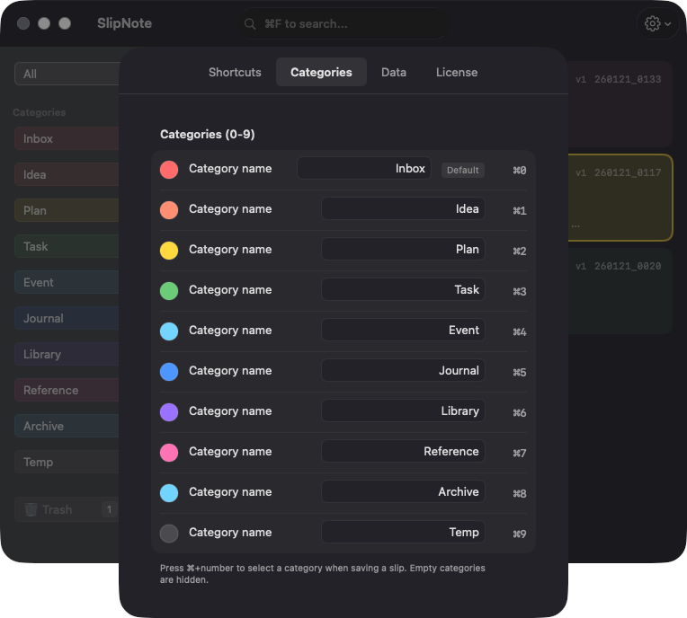

# SlipNote

A lightweight macOS menu bar app for quick note-taking and organization.

빠른 메모 작성과 정리를 위한 macOS 메뉴바 앱입니다.


## Screenshots

### Quick Input


### Browser


### Detail View
| View Mode | Edit Mode | Version History |
|-----------|-----------|-----------------|
|  |  |  |

### Settings
| Shortcuts | Categories | Data |
|-----------|------------|------|
|  |  |  |

## Features

- **Quick Input** - Global shortcut (Cmd+Shift+N) to capture notes from anywhere
- **10 Categories** - Organize notes with customizable categories (0-9)
- **Browser** - View and manage all notes with filtering and search
- **Pin** - Pin important notes to the top of the list
- **Multi-selection** - Bulk operations on multiple notes
- **Version History** - Track changes to your notes
- **Auto Backup** - Automatic periodic backups (Daily/Weekly/Monthly)
- **Spotlight Search** - Find notes via macOS Spotlight
- **URL Scheme** - Integrate with external apps and automation tools
- **Export** - Export notes as Markdown

## Installation

1. Download `SlipNote_v1.0.dmg` from Releases
2. Open the DMG file
3. Drag `SlipNote.app` to Applications folder
4. Launch SlipNote from Applications

## Keyboard Shortcuts

### Global
| Shortcut | Action |
|----------|--------|
| Cmd+Shift+N | Open quick input window |
| Cmd+Shift+B | Toggle browser window |

### Quick Input
| Shortcut | Action |
|----------|--------|
| Cmd+Number(0-9) | Save to category |
| Esc | Close window |

### Browser
| Shortcut | Action |
|----------|--------|
| Cmd+Number(0-9) | Toggle category filter |
| Cmd+T | Toggle Trash filter |
| Cmd+F | Focus search |
| Up/Down | Navigate notes |
| Enter | View note details |
| Cmd+Enter | Edit note |
| Option+Number(0-9) | Change category |
| Cmd+Delete | Move to Trash |
| Cmd+P | Pin/Unpin note |
| Cmd+C | Copy as Markdown |
| Cmd+N | Create new note |
| Cmd+, | Open settings |

## URL Scheme

```
# Create new note
slipnote://new?content=Note%20content&category=1

# Open browser
slipnote://browse
slipnote://browse?category=3

# Search
slipnote://search?query=keyword

# Open input window
slipnote://input
```

## Default Categories

| Key | Category |
|-----|----------|
| 0 | Inbox (default) |
| 1 | Idea |
| 2 | Plan |
| 3 | Task |
| 4 | Event |
| 5 | Journal |
| 6 | Library |
| 7 | Reference |
| 8 | Archive |
| 9 | Temp |

Categories can be customized in Settings.

## Data Storage

All data is stored locally:
- Database: `~/Library/Application Support/SlipNote/slipnote.db`
- Backups: `~/Library/Application Support/SlipNote/Backups/`

## Documentation

- [English Manual](SlipNote_Manual_EN.md)
- [한글 매뉴얼](SlipNote_Manual_KO.md)

## Requirements

- macOS 12.0 (Monterey) or later
- Universal binary (Apple Silicon & Intel)

## License

Source Available (Proprietary) - see [License.txt](License.txt)

This software is source-available but NOT open source. Personal use is permitted. Commercial use, redistribution, and publishing derivative works are not permitted.

## Contact

Copyright © 2026 gamzabi@me.com
